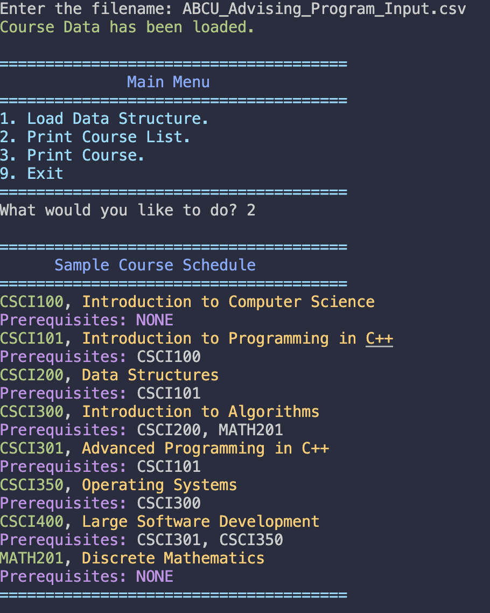
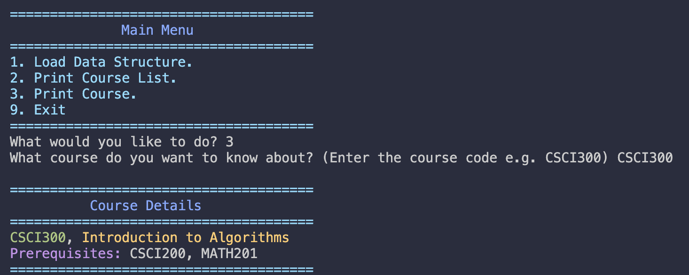

# 🎓 Course Planner

## Overview
The **Course Planner** application is a command-line interface (CLI) tool designed to assist academic advisors in managing and viewing course data for a Computer Science program. It allows users to:
- Load course data from a CSV file.
-  Display an alphanumerically ordered list of all courses.
-  Print detailed information about specific courses, including their prerequisites.

## Features
- **Load Course Data**: Easily load course information from a CSV file.
- **View All Courses**: Display a neatly formatted, alphanumerically ordered list of all courses.
- **Course Details**: Retrieve and display detailed information about individual courses and their prerequisites.
- **User-Friendly Interface**: Enjoy a visually appealing, color-coded command-line interface.

## Prerequisites
- **C++14 or later**
- **A C++ compiler** (e.g., g++)

## How to Use

### 📥 Load Data Structure
1. Enter `1` to load course data from a CSV file.
2. Provide the filename when prompted (e.g., `ABCU_Advising_Program_Input.csv`).

### 📜 Print Course List
1. Enter `2` to display an alphanumerically ordered list of courses.

### 🔎 Print Course
1. Enter `3` and provide a course number to see detailed information about the course and its prerequisites.

### 🚪 Exit
 Enter `9` to exit the application.

## Sample Output





## Compilation and Execution

### Compile the Main Program
To compile the main application, use the following command:
```sh
g++ -std=c++14 -o course_planner ProjectTwo.cpp
```

### Run the Main Program
To run the compiled application, use the following command:
```sh
./course_planner
```
## Project Structure
- `ProjectTwo.cpp`: Main application code.
- `ABCU_Advising_Program_Input.csv`: Sample input file containing course data.

## Additional Information
- **Color Coding**: The CLI uses color coding to enhance readability:
  - **Green**: Course numbers.
  - **Yellow**: Course titles.
  - **Magenta**: Prerequisites.
  - **Cyan**: Section headers and dividers.
  - **Orange**: Error messages and warnings.

## Dockerized Deployment
To deploy the Course Planner application using Docker, follow these steps:
1. Build the Docker image:
```sh
docker build -t course_planner_image .
```
2. Run the Docker container:
```sh
docker run -it --rm course_planner_image
```

In the Docker container, you can interact with the Course Planner application as you would in a local environment, no need to install any dependencies, just need to have Docker installed. clear
